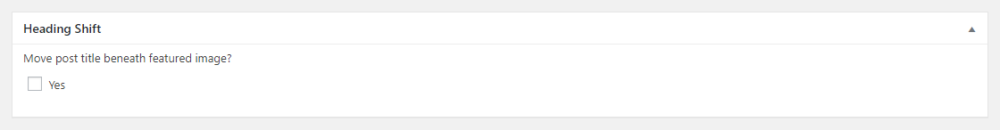

# GPA Heading shift for Wordpress:Newspaper

This plugin provides backend support to move the article title below the featured image on a WordPress post. It will add the following metabox to the the post admin area:



The metabox only appears when the Style 3, 7 and 8 are selected from Post Settings.

The plugin defaults to an Unchecked box, meaning the title will not shift. When Checked option is selected a save is necessary to register in post metavalues.

The plugin will subsequently add one custom field to the post metavalues:

| Metafield                  | Value                                             |
|----------------------------|---------------------------------------------------|
| `_add_heading_title_shift` | string: false or true based on checkbox selection |
| `_iip_post_second_author`  | string: ID of the selected user                   |

## Theme Support

This plugin adds one additional field to a post's metadata. It will not display those values on the front end out of the box. In order to display these fields you will need to add a few lines to the relevant site's theme. We suggest something like:

```php
$heading_title_shift = get_post_meta( $this->post->ID, "_add_heading_title_shift", true );';
```

The above code snippet will create a variable $heading_title_shift.